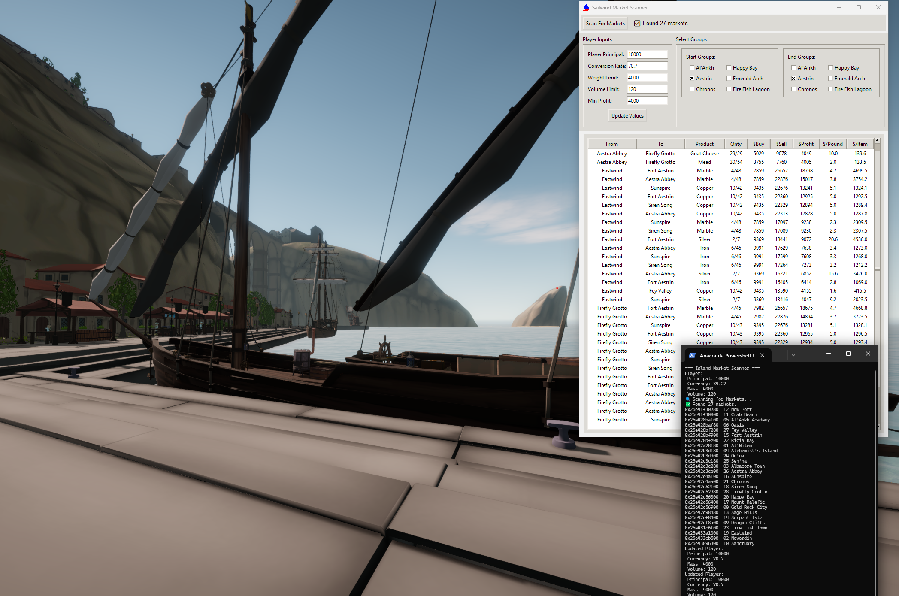

# ⛵ Sailwind Market Watcher


A real-time market and trade route analyzer for the open-world sailing game **Sailwind**.

This tool connects to your running game, reads market data directly from memory, and helps you plan the most profitable trade routes between ports — all via an interactive graphical interface.

---

## 📌 Features

✅ **Live Memory Scan**  
Scans all 27 in-game markets for live product supply data and prices.

💰 **Profit-Driven Trade Routes**  
Automatically finds the most profitable trades based on:
- Total profit
- Profit per pound (weight)
- Profit per item

🎯 **Player-Conscious Filtering**  
Takes into account your current:
- Money
- Cargo mass & volume limits
- Minimum profit threshold

🌎 **Regional Trade Planning**  
Select specific **start** and **destination** island groups to tailor your strategy.

🖼️ **Interactive GUI**  
A modern, user-friendly interface with:
- Live-updating trade table
- Tooltips for helpful guidance
- Input fields for cargo & currency

---
💡 Development
This project is written in Python using:
- tkinter for the GUI
- pymem for memory access
- psutil for process handling
- Pillow for image icons

---
🧠 How It Works
This app reads Sailwind’s memory using pymem, scanning for a known pattern of market objects. 
It interprets product supplies and calculates dynamic prices using the game’s internal pricing formula.
It does not modify game memory or change game behavior.

## 🧰 Requirements

- Windows OS
- Python 3.9+
- The game [**Sailwind** on Steam](https://store.steampowered.com/app/1284190/Sailwind)
- Python dependencies:
  - `pymem`
  - `psutil`
  - `pillow`

Install dependencies with:

```bash
pip install -r requirements.txt
